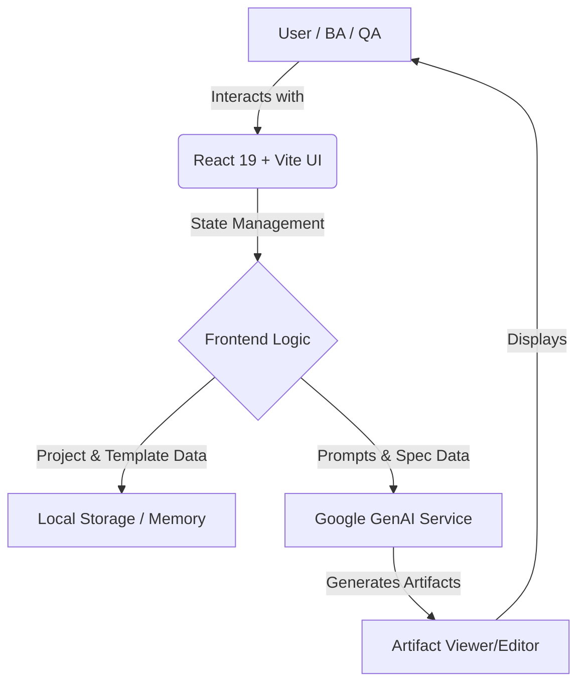

<div align="center">
  <h1>🚀 Anson Precision</h1>
  <p><strong>AI-Native Spec-Driven Development Platform</strong></p>

  <p>
    <a href="#features">Features</a> •
    <a href="#architecture">Architecture</a> •
    <a href="#installation">Installation</a> •
    <a href="#configuration">Configuration</a> •
    <a href="#contributing">Contributing</a>
  </p>
</div>

---

## 📖 Introduction

**Anson Precision** is a cutting-edge, AI-native platform designed to bridge the gap between Business Analysis (BA), Software Engineering, and Quality Assurance (QA). By mapping a **Spec-Driven Development (SDD)** workflow directly to the traditional **V-Model development lifecycle**, the platform automatically generates, manages, and synchronizes essential project artifacts.

From Business Requirements Documents (BRD) and System Architecture Documents (SAD) to User Acceptance Testing (UAT) plans and API specifications, Anson Precision leverages the power of Gemini AI to ensure functional completeness and absolute UI/UX consistency across all phases of your development cycle.

---

## ✨ Key Features

- 🤖 **AI-Powered Workspace:** Automatically generate standard V-Model artifacts (BRD, SRS, SAD, Test Plans, API Specs) using context-aware Gemini AI.
- 📊 **Collaborative Dashboard:** Gain complete, real-time visibility into project health, recent document generations, and test case status.
- 🧪 **Testing & QA Hub:** A comprehensive tracker for System Tests, Integration Tests, Unit Tests, and UAT with priority tags and actionable metrics.
- 📁 **Project & Template Management:** Manage multiple enterprise software projects and customize your documentation structure using dynamic templates.
- 🌗 **Premium UI/UX:** Built with motion animations and seamless Dark/Light mode support, prioritizing developer and analyst experience.

---

## 🏗️ Overall Architecture

Anson Precision is built using a modern, fast, and scalable frontend stack. The application acts as a rich client interacting with AI models to perform document and code analysis.



**Tech Stack:**
- **Core:** React 19, TypeScript, Vite 6
- **Styling:** Tailwind CSS v4, Motion (Animations)
- **Icons:** Lucide React
- **AI Integration:** `@google/genai` (Gemini API)

---

## 💻 Installation

Make sure you have [Node.js](https://nodejs.org/) (version 18 or higher) installed on your machine.

1. **Clone the repository:**
   ```bash
   git clone https://github.com/phuc2502/anson.git
   cd anson
   ```

2. **Install dependencies:**
   ```bash
   npm install
   ```

---

## 🚀 Running the Project

Start the local development server with Hot Module Replacement (HMR).

```bash
npm run dev
```
By default, the server will run on `http://localhost:3000/`.

To build the project for production:
```bash
npm run build
```

To preview the production build:
```bash
npm run preview
```

---

## ⚙️ Env Configuration

The application requires an environment variable to interact with the AI Engine. Create a `.env` file in the root directory:

```bash
touch .env
```

Add your Gemini API key to the file:

```env
GEMINI_API_KEY=your_google_gemini_api_key_here
```

*(Note: The `vite.config.ts` is already configured to expose `process.env.GEMINI_API_KEY` to the application securely).*

---

## 📂 Folder Structure

A quick look at the project's layout:

```text
.
├── src/
│   ├── components/         # Reusable UI components and main Views
│   │   ├── AIWorkspaceView.tsx
│   │   ├── DashboardView.tsx
│   │   ├── Sidebar.tsx
│   │   ├── TopBar.tsx
│   │   └── ... (other views)
│   ├── App.tsx             # Main Application routing and state entry
│   ├── index.css           # Global Tailwind CSS and Base Variables
│   ├── main.tsx            # React DOM mounting
│   └── types.tsx           # TypeScript Interfaces (Template, Project, etc.)
├── .env                    # Environment variables (Not tracked in Git)
├── package.json            # Project metadata and dependencies
├── tsconfig.json           # TypeScript configuration
└── vite.config.ts          # Vite build and plugin configuration
```

---

## 🤝 Contribution Guidelines

We welcome contributions from developers, technical writers, and designers. To contribute:

1. **Fork** the repository.
2. **Create a branch** for your feature or bug fix: `git checkout -b feature/your-feature-name`.
3. **Commit** your changes with clear messages.
4. **Push** to your fork: `git push origin feature/your-feature-name`.
5. Open a **Pull Request** against the `main` branch.

Please ensure your code passes continuous integration checks, including `npm run lint` and all related tests.

---

## 📝 License

This project is licensed under the [Apache License 2.0](https://www.apache.org/licenses/LICENSE-2.0). 

---

## 🗺️ Roadmap

- [x] **Phase 1:** Core UI layout, Dashboard, and initial V-Model Template configurations.
- [x] **Phase 2:** Gemini GenAI integration for dynamic Business Requirements Document (BRD) generation.
- [ ] **Phase 3:** Advanced Test Case auto-generation based on BRD/SRS requirements.
- [ ] **Phase 4:** GitHub/GitLab integration to automatically sync generated specs to repositories.
- [ ] **Phase 5:** Multi-user collaborative editing and version history of generated standard artifacts. 

<div align="center">
  <i>Built with ❤️ by the Anson Precision Team.</i>
</div>
