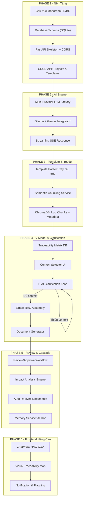
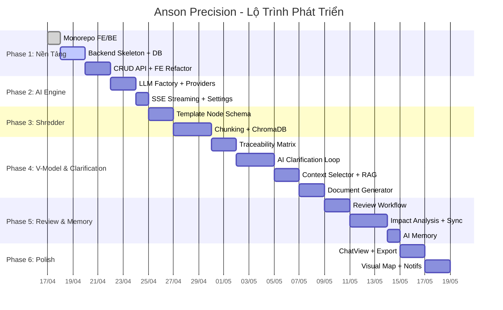

# 🚀 ANSON PRECISION — Timeline Thực Hiện Dự Án

> **AI-Native Spec-Driven Development Platform**
> Nền tảng tự động sinh tài liệu SDLC theo mô hình chữ V với khả năng ánh xạ dây chuyền (Traceability) và bộ nhớ AI (Memory).

---

## 📋 Tổng Quan Kiến Trúc



---

## 🗓️ Chi Tiết Từng Phase

---

### PHASE 1 — Nền Tảng Hạ Tầng (Foundation)
> **Thời gian ước tính:** 3–4 ngày
> **Trạng thái:** 🟡 Đang thực hiện (50%)

| # | Task | Mô tả | Trạng thái |
|---|------|--------|------------|
| 1.1 | Monorepo FE/BE | Tách `frontend/` và `backend/`, cấu hình `.env`, `.gitignore` | ✅ Hoàn thành |
| 1.2 | Backend Skeleton | Tạo `main.py` FastAPI, cấu hình CORS, health check endpoint `/api/health` | ⬜ Chưa bắt đầu |
| 1.3 | Database Schema | Thiết kế bảng `projects`, `templates`, `documents`, `doc_nodes`, `traceability_links` trong SQLite qua SQLAlchemy | ⬜ Chưa bắt đầu |
| 1.4 | CRUD API | REST endpoints: `POST/GET/PUT/DELETE` cho Projects và Templates | ⬜ Chưa bắt đầu |
| 1.5 | Frontend Refactor | Chuyển `useState` cứng trong `App.tsx` thành gọi API fetch/axios tới Backend | ⬜ Chưa bắt đầu |
| 1.6 | Chạy thử E2E | `npm run dev` (FE port 3000) + `uvicorn` (BE port 8000), xác nhận kết nối OK | ⬜ Chưa bắt đầu |

**Deliverable (Kết quả giao):** Frontend và Backend chạy song song, dữ liệu Projects/Templates lưu vào SQLite thay vì hardcode.

---

### PHASE 2 — AI Engine (Tích Hợp Đa Mô Hình)
> **Thời gian ước tính:** 2–3 ngày
> **Trạng thái:** ⬜ Chưa bắt đầu

| # | Task | Mô tả | Trạng thái |
|---|------|--------|------------|
| 2.1 | LLM Factory | Hoàn thiện class `LLMFactory` — nhận `{provider, model}` từ FE, khởi tạo đúng client | 🟡 Khung sẵn |
| 2.2 | Ollama Provider | Kết nối Ollama local (`qwen2.5`, `gemma2`) qua `httpx` async | ⬜ Chưa bắt đầu |
| 2.3 | Gemini Provider | Kết nối Google Gemini API qua `google-genai` SDK, dùng `GEMINI_API_KEY` từ `.env` | ⬜ Chưa bắt đầu |
| 2.4 | SSE Streaming | Endpoint `/api/generate/stream` trả response dạng Server-Sent Events cho hiệu ứng typing trên FE | ⬜ Chưa bắt đầu |
| 2.5 | Settings UI | Dropdown chọn Provider + Model trong trang Cài đặt React | ⬜ Chưa bắt đầu |

**Deliverable:** User có thể chọn Gemini hoặc Ollama từ UI, gửi prompt đơn giản và nhận streaming response hiển thị trên màn hình.

---

### PHASE 3 — Template Shredder (Máy Băm Cấu Trúc)
> **Thời gian ước tính:** 4–5 ngày
> **Trạng thái:** ⬜ Chưa bắt đầu

Đây là phần **Core IP (Sở hữu trí tuệ cốt lõi)** của dự án.

| # | Task | Mô tả | Trạng thái |
|---|------|--------|------------|
| 3.1 | Template Node Schema | Thiết kế cấu trúc cây cho Template: mỗi Template gồm nhiều `Section`, mỗi `Section` có `fields[]` cần điền | ⬜ Chưa bắt đầu |
| 3.2 | Template Parser Service | Khi user upload/tạo Template mẫu (BRD/SRS/SAD), hệ thống gọi LLM phân tích cấu trúc → trả về Tree JSON | ⬜ Chưa bắt đầu |
| 3.3 | Semantic Chunking | Nhận Raw Requirements (text thô) từ user, cắt thành Chunks theo ngữ nghĩa + gắn metadata tag (`actor`, `feature`, `constraint`, `api`...) | ⬜ Chưa bắt đầu |
| 3.4 | Embedding & Store | Dùng model `nomic-embed-text` để vector hóa Chunks, lưu vào ChromaDB collection `project_docs` | ⬜ Chưa bắt đầu |
| 3.5 | Upload UI | Giao diện FE cho phép user paste/upload Raw Requirements text → hiển thị kết quả Chunks đã phân tích để xác nhận | ⬜ Chưa bắt đầu |

**Deliverable:** User paste yêu cầu thô vào → hệ thống tự động chia nhỏ, gắn tag, lưu Vector DB. User có thể xem lại danh sách Chunks đã phân mảnh.

---

### PHASE 4 — V-Model Traceability, Clarification Loop & Document Generation
> **Thời gian ước tính:** 6–8 ngày
> **Trạng thái:** ⬜ Chưa bắt đầu

Đây là phần phức tạp nhất — biến hệ thống thành một **"Nhà máy sản xuất tài liệu tự động"**, kèm theo cơ chế **AI hỏi lại khi thiếu context**.

| # | Task | Mô tả | Trạng thái |
|---|------|--------|------------|
| 4.1 | Traceability Matrix | Bảng `traceability_links` lưu quan hệ: `SRS_Node_A` ← `mapped_from` ← `BRD_Node_B`. Mỗi Node có `version` | ⬜ Chưa bắt đầu |
| 4.2 | V-Model Dependency Rules | Định nghĩa luật phụ thuộc: SRS cần BRD, SAD cần SRS, Test Plan cần SAD, UAT cần BRD+SRS | ⬜ Chưa bắt đầu |
| 4.3 | Context Selector (FE) | Khi user chọn "Tạo SRS", UI bắt buộc chọn tài liệu gốc (BRD nào?) làm Source of Truth | ⬜ Chưa bắt đầu |
| **4.4** | **🧠 Context Sufficiency Check** | **AI phân tích Template Tree + Retrieved Chunks → đánh giá có đủ context không. Trả về `{sufficient: bool, gaps: [...]}`.** | ⬜ Chưa bắt đầu |
| **4.5** | **🧠 Clarification Q&A Generator** | **Nếu thiếu context, AI tự sinh ra danh sách câu hỏi có chọn lựa (multiple-choice + open-ended). VD: "Hệ thống thanh toán hỗ trợ: (A) Stripe (B) VNPay (C) Cả hai? (D) Khác?"** | ⬜ Chưa bắt đầu |
| **4.6** | **🧠 Clarification UI (FE)** | **Giao diện hiển thị câu hỏi dạng form (radio buttons, checkbox, text input). User trả lời → câu trả lời được embed vào context → re-check sufficiency.** | ⬜ Chưa bắt đầu |
| 4.7 | Smart RAG Assembly | Dựa trên Template Tree + Dependency Rules + Câu trả lời Clarification → truy vấn ChromaDB lấy đúng Chunks cần thiết | ⬜ Chưa bắt đầu |
| 4.8 | Prompt Builder | Ghép: System Prompt + Template Structure + Retrieved Chunks + Clarification Answers → Prompt hoàn chỉnh | ⬜ Chưa bắt đầu |
| 4.9 | Document Generator | Gọi LLM Factory (Phase 2) sinh nội dung → Parse output → Lưu kết quả vào DB kèm Traceability Links | ⬜ Chưa bắt đầu |
| 4.10 | Generated Doc Viewer (FE) | Hiển thị tài liệu đã sinh, bên cạnh mỗi Section hiển thị "Nguồn gốc: BRD Mục X" | ⬜ Chưa bắt đầu |

> [!TIP]
> **Luồng AI Clarification Loop hoạt động theo vòng lặp:**
> ```
> User chọn loại tài liệu → Chọn Source → AI kiểm tra đủ context?
>   ├─ ✅ Đủ → Tiến hành Generate
>   └─ ❌ Thiếu → AI sinh câu hỏi → User trả lời → Quay lại kiểm tra
> ```
> Vòng lặp này giống cách Claude/ChatGPT hỏi lại trước khi thực hiện task phức tạp, nhưng có cấu trúc (form-based) thay vì chat tự do.

**Deliverable:** User chọn loại tài liệu → chọn Source → AI kiểm tra, hỏi lại nếu thiếu → user trả lời → sinh tài liệu hoàn chỉnh với truy xuất nguồn gốc.

---

### PHASE 5 — Review, Cascade Sync & AI Memory
> **Thời gian ước tính:** 5–6 ngày
> **Trạng thái:** ⬜ Chưa bắt đầu

Đây là **Killer Feature** — giải quyết bài toán đau đầu nhất của Business Analyst: *"Thay đổi 1 dòng BRD → phải sửa 10 file khác"*.

| # | Task | Mô tả | Trạng thái |
|---|------|--------|------------|
| 5.1 | Review UI | Giao diện cho phép user đọc Draft → Chỉnh sửa inline → Approve/Reject từng Section | ⬜ Chưa bắt đầu |
| 5.2 | Version Control | Mỗi lần Approve = tạo version mới cho Node đó. Giữ lịch sử thay đổi (Audit Trail) | ⬜ Chưa bắt đầu |
| 5.3 | Impact Analysis | Khi 1 Node thay đổi version → quét `traceability_links` → liệt kê toàn bộ Node ở tài liệu khác bị ảnh hưởng | ⬜ Chưa bắt đầu |
| 5.4 | Cascade Re-sync | Tự động gọi LLM cập nhật lại NỘI DUNG các Node bị ảnh hưởng dựa trên context mới | ⬜ Chưa bắt đầu |
| 5.5 | Flagging System | Đánh dấu đỏ + thông báo: "SRS Mục 3.2 đã lỗi thời vì BRD Mục 2.1 vừa được sửa" | ⬜ Chưa bắt đầu |
| 5.6 | AI Memory (Long-term) | Trích xuất bài học từ quá trình Review (feedback loop): "User luôn sửa lại phần Security → AI nhớ và tự bổ sung lần sau" | ⬜ Chưa bắt đầu |
| 5.7 | Memory Storage | Lưu Memory dạng Vector vào ChromaDB collection `ai_memory`, inject vào System Prompt ở các lần gen sau | ⬜ Chưa bắt đầu |

**Deliverable:** Sửa BRD → toàn bộ SRS, Test Case liên quan tự động cập nhật hoặc bị đánh dấu cần review. AI càng dùng càng thông minh nhờ Memory.

---

### PHASE 6 — Frontend Nâng Cao & Polish
> **Thời gian ước tính:** 3–4 ngày
> **Trạng thái:** ⬜ Chưa bắt đầu

| # | Task | Mô tả | Trạng thái |
|---|------|--------|------------|
| 6.1 | ChatView (RAG) | Giao diện Chat hỏi đáp với tài liệu dự án: "Yêu cầu nào liên quan đến module thanh toán?" | ⬜ Chưa bắt đầu |
| 6.2 | Visual Traceability Map | Sơ đồ trực quan thể hiện mối quan hệ giữa tất cả các tài liệu (dạng Graph/Network) | ⬜ Chưa bắt đầu |
| 6.3 | Export PDF/Docx | Xuất tài liệu đã sinh ra file PDF hoặc Word với format chuẩn doanh nghiệp | ⬜ Chưa bắt đầu |
| 6.4 | Notification Center | Thông báo real-time khi có tài liệu bị Outdated hoặc cần Review | ⬜ Chưa bắt đầu |
| 6.5 | UI/UX Polish | Dark mode fix, animation mượt, responsive, loading skeleton | ⬜ Chưa bắt đầu |

**Deliverable:** Sản phẩm hoàn chỉnh, sẵn sàng demo hoặc triển khai nội bộ.

---

## 📊 Tổng Hợp Timeline



> [!IMPORTANT]
> **Tổng thời gian ước tính: ~28–35 ngày làm việc** (khoảng 6-7 tuần nếu làm bán thời gian). Có thể rút ngắn nếu tập trung full-time hoặc cắt bớt tính năng ở Phase 6.

---

## 🎯 Thứ Tự Ưu Tiên Đề Xuất

| Ưu tiên | Phase | Lý do |
|---------|-------|-------|
| 🔴 Cao nhất | Phase 1 | Không có nền tảng thì không làm gì được |
| 🔴 Cao nhất | Phase 3 | Core IP — Máy Băm Cấu Trúc quyết định chất lượng toàn bộ hệ thống |
| 🟠 Cao | Phase 2 | AI Engine là động cơ, nhưng có thể mock tạm bằng hardcoded response |
| 🟠 Cao | Phase 4 | V-Model Traceability là giá trị khác biệt lớn nhất của sản phẩm |
| 🟡 Trung bình | Phase 5 | Cascade Sync và Memory là "wow factor" nhưng cần Phase 3+4 chạy ổn trước |
| 🟢 Thấp | Phase 6 | UI nâng cao — làm sau cùng khi core logic đã vững |
